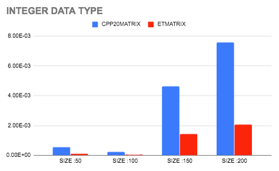
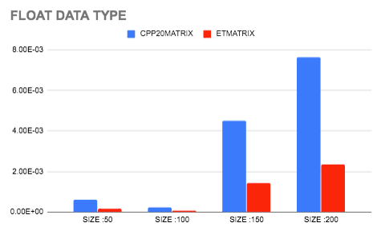
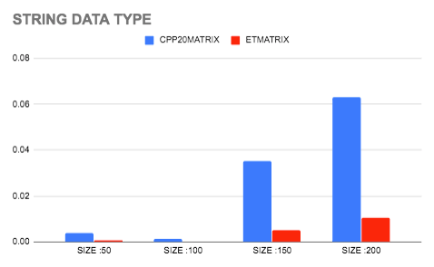

# Boost uBLAS GSoC 2020 Competency Test - Building Matrix Libraries

## Overview

It is my submission for the competency test for BOOST uBLAS Competency Test for GSoC 2020. It contains two libraries in `include` folder. First is the `CPP20Matrix.hpp` which is a Matrix Library for addition of two or more matrices built using advanced features of C++20. Other is the `ETMatrix.hpp` library which is also used for addition of two or more matrices but it is built using Expression Templates.

## To run the program

I would like to explain by running `example\example_file.cpp`

```
cd example
g++ example_file.cpp
./a.out
```

## Speed Comparisions

I have made test files for testing both `ETMatrix.hpp` and `CPP20Matrix.hpp` present in `test` folder. Below are the comparisons between the speed of both libraries on different data types and sizes of matrices.
1)  Below represents the time consumption analysis of both the libraries for **Integer data type**
    
    

2)  Below represents the time consumption analysis of both the libraries for **Float data type**
    
    
   
3)  Below represents the time consumption analysis of both the libraries for **String data type**
    
    

#### Note: Please do not use it for submitting a proposal for GSoC to BOOST Organisation, however, feel free to read and learn from it.
